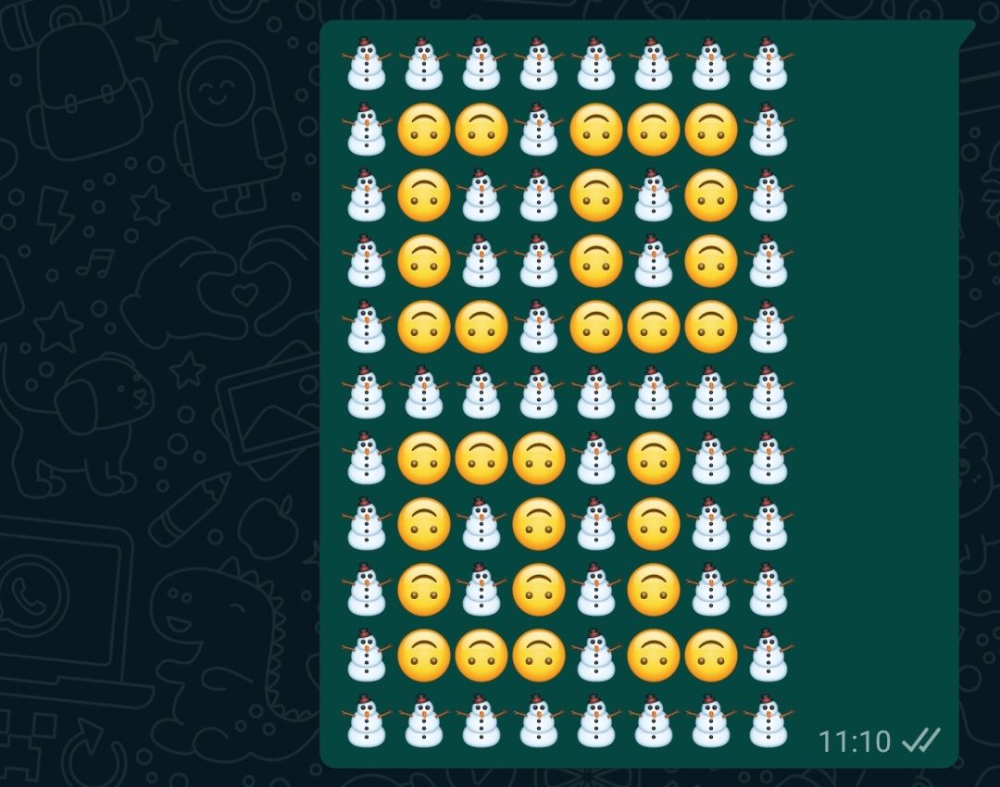

# Emoji pixelart: Pixelart to send to your friends!

Create or load pixelart and convert it into an emoji raster!

Visit at <https://vkuhlmann.github.io/emoji-pixelart>.

Emoji's aren't always monospace unfortunately. In your default font, this may look off:

⛄⛄⛄⛄⛄⛄⛄⛄ 
⛄🙃🙃⛄🙃🙃🙃⛄ 
⛄🙃⛄⛄🙃⛄🙃⛄ 
⛄🙃⛄⛄🙃⛄🙃⛄ 
⛄🙃🙃⛄🙃🙃🙃⛄ 
⛄⛄⛄⛄⛄⛄⛄⛄ 
⛄🙃🙃🙃⛄🙃⛄⛄ 
⛄🙃⛄🙃⛄🙃⛄⛄ 
⛄🙃⛄🙃⛄🙃⛄⛄ 
⛄🙃🙃🙃⛄🙃🙃⛄ 
⛄⛄⛄⛄⛄⛄⛄⛄ 
